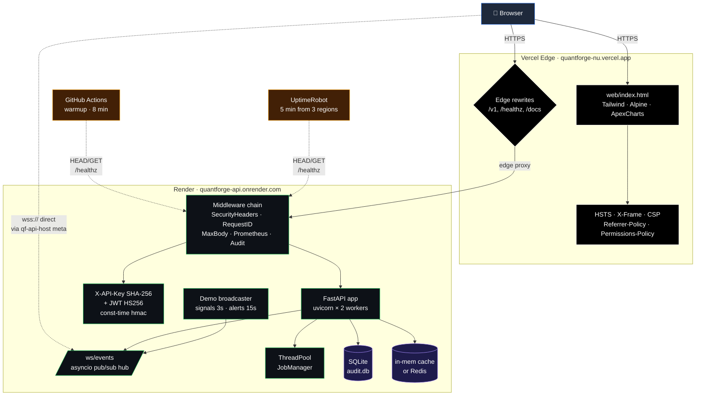
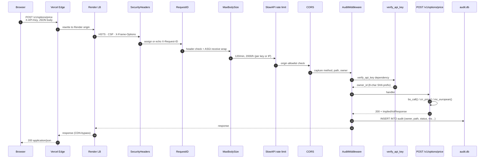
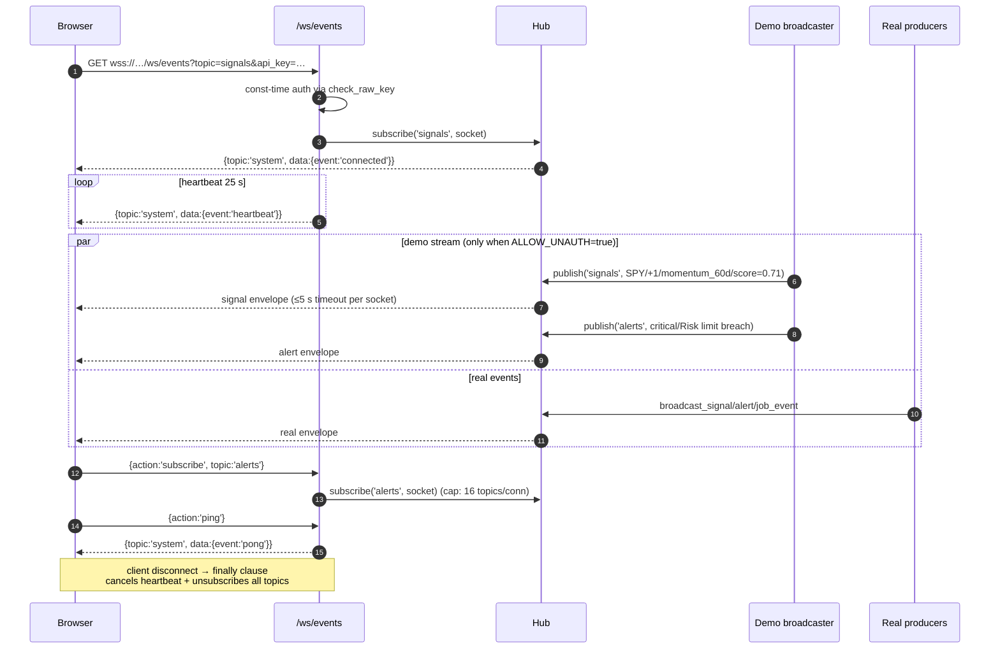
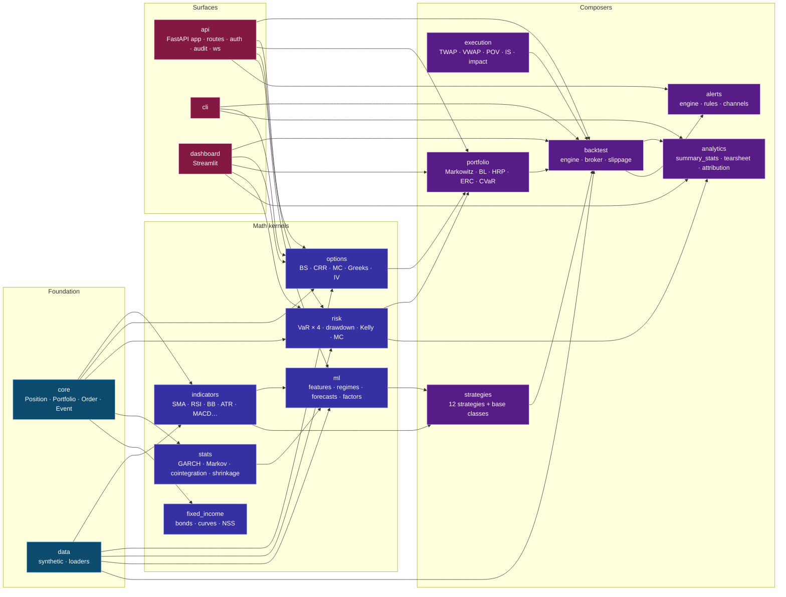
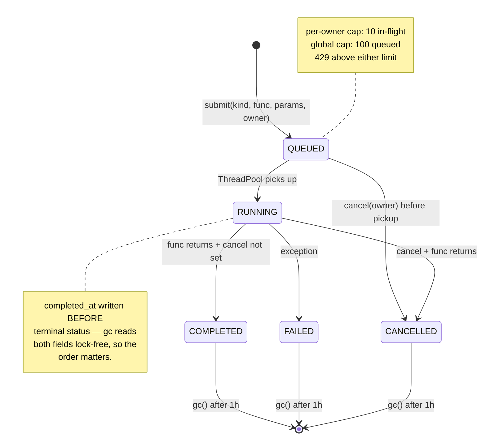
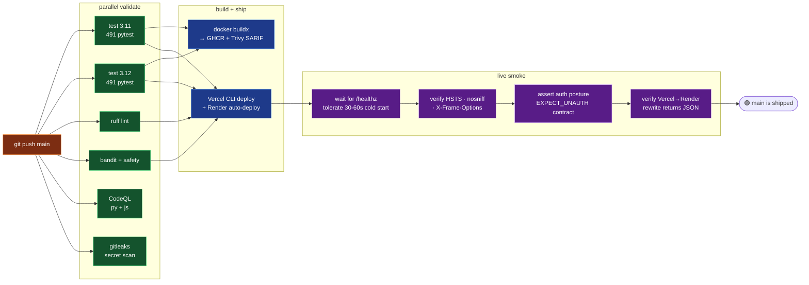
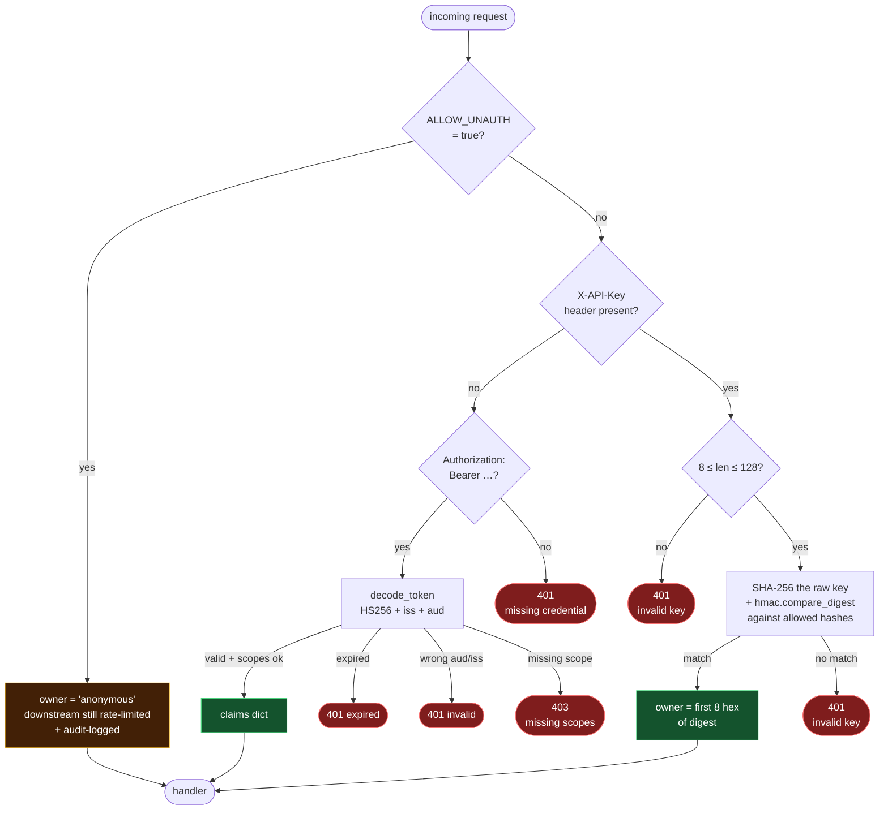
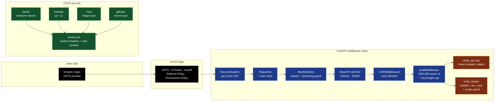

<div align="center">

# QuantForge

**A full-stack quantitative trading research platform — Python library, hardened REST API, real-time terminal, dashboard, and CLI in one repo.**

[**🌐 Live demo**](https://quantforge-nu.vercel.app) · [**📚 API reference**](https://quantforge-api.onrender.com/docs) · [**🔬 OpenAPI spec**](https://quantforge-api.onrender.com/openapi.json) · [**📈 Status page**](https://stats.uptimerobot.com/6glZXHXYmV)

[](https://github.com/theNeuralHorizon/quantforge/actions/workflows/ci.yml)
[](https://github.com/theNeuralHorizon/quantforge/actions/workflows/warmup.yml)
[](https://github.com/theNeuralHorizon/quantforge/actions/workflows/codeql.yml)
[](https://github.com/theNeuralHorizon/quantforge/actions/workflows/gitleaks.yml)
[](https://stats.uptimerobot.com/6glZXHXYmV)


</div>

---

## Why this exists

Most quant research lives in three disconnected places: a notebook for the math, an API service for the production surface, and a separate UI for the humans. Drift between them is constant, and shipping anything end-to-end means stitching three tool-chains together by hand.

QuantForge fuses all three behind a single Python package and one CI pipeline. The same `bs_call(...)` you import in a notebook is the function FastAPI exposes at `/v1/options/price`, the function the Streamlit dashboard calls in-process, the function the terminal hits over HTTPS, and the function the CLI shells out to. Tests, security scans, container builds, and deploy hooks all run in one coherent CI/CD graph on every push to `main`.

The live demo is in **demo mode** — `QUANTFORGE_ALLOW_UNAUTH=true` — so you can poke at every endpoint without an API key. A server-side broadcaster fires synthetic signals + alerts on a loop so the Live Signals and Alerts pages always have a stream to show.

---

## Table of contents

- [System architecture](#system-architecture)
- [Request lifecycle](#request-lifecycle)
- [Real-time WebSocket flow](#real-time-websocket-flow)
- [Module dependency graph](#module-dependency-graph)
- [Job queue state machine](#job-queue-state-machine)
- [CI/CD pipeline](#cicd-pipeline)
- [Authentication decision tree](#authentication-decision-tree)
- [Quick start](#quick-start)
- [Module reference](#module-reference)
- [API surface](#api-surface)
- [Examples](#examples)
- [Test coverage](#test-coverage)
- [Performance characteristics](#performance-characteristics)
- [Security architecture](#security-architecture)
- [Operations](#operations)
- [Documentation](#documentation)
- [Roadmap](#roadmap)
- [License](#license)

---

## System architecture

The production topology splits responsibilities across two free-tier hosts. The browser only ever talks to Vercel; Vercel proxies HTTP API paths to Render, while WebSocket connections bypass the proxy and hit Render directly (Vercel rewrites don't carry WS upgrades). Auth, audit, rate-limiting, and the job queue all live on the API side.



**Why split this way:**

- Vercel CDN-caches the static UI globally; Render gives the API a persistent Python runtime.
- A single browser origin → no CORS dance for HTTP.
- WebSocket goes direct because Vercel rewrites don't proxy WS upgrades; the UI's `<meta name="qf-api-host">` tells the JS client which host to connect to.
- Free-tier safe: keep both pieces awake with a GitHub Actions cron and an UptimeRobot probe.
- Independent rollback: revert the API without touching the UI, or vice versa.

---

## Request lifecycle

Anatomy of a single authenticated POST — say, `/v1/options/price` — from browser keystroke to JSON response. Every numbered step has a one-or-two-file source pointer.



A single 200 carries `X-Request-ID`, `X-Response-Time-Ms`, `X-RateLimit-Remaining`, plus the security headers. Median latency from a warm Render container in Oregon is ~12 ms server-side, ~150-300 ms wall including transit.

---

## Real-time WebSocket flow

The Live Signals and Alerts panels stream over a single shared `/ws/events` connection. Subscribers can switch topics without reconnecting; an asyncio pub/sub hub fans out events with per-socket timeouts so one slow client can't stall the broadcast.



Hardening invariants:

- **Topic regex** `^[A-Za-z0-9_.:-]+$`, max 64 chars — no path injection.
- **Inbound message size** capped at 4 KiB to block memory bombs.
- **Topics-per-connection** capped at 16 to bound `clients` dict growth.
- **Per-socket publish timeout** 5 s via `asyncio.wait_for` — slow clients are dropped, not waited on.
- **Constant-time auth** mirrors the HTTP path's timing profile (shared `check_raw_key`).

---

## Module dependency graph

The Python package is layered from primitives up. Each upper-layer module imports only from layers below it; no cycles. The graph is what makes a notebook function and an API endpoint use the same code path.



Any unit test exercises a slice of this graph; any API call exercises a vertical from `api/` down to a leaf math kernel.

---

## Job queue state machine

Long-running work — backtests, ML training, walk-forward sweeps — goes through `quantforge.api.jobs.JobManager`, a thread-pool-backed queue with optional Redis persistence. State transitions are deliberate and ordered to avoid the gc/writer race the security review surfaced earlier in the codebase.



---

## CI/CD pipeline

Every push to `main` triggers a 7-job DAG. Tests + lint + security run in parallel; deploy is gated on all three; Docker build to GHCR runs in parallel with deploy because Render builds its own image; smoke runs after deploy and asserts both API health and the Vercel rewrite path end-to-end.



Independent workflows on the same repo:

- **`warmup.yml`** — pings 5 paths every 8 minutes so Render's free plan never sleeps.
- **`codeql.yml`** — weekly + per-PR static analysis on Python and JavaScript.
- **`gitleaks.yml`** — secret scanning on every push.

---

## Authentication decision tree

Two auth methods, one decision tree. Every `/v1/*` route runs through this:



`/v1/auth/token` mints JWTs but the route enforces a **self-grantable** scope set so a key holder can't promote themselves to `admin`.

---

## Quick start

```bash
# clone + install
git clone https://github.com/theNeuralHorizon/quantforge.git && cd quantforge
pip install -r requirements.txt

# run any of the 11 end-to-end examples
PYTHONPATH=. python examples/02_options_surface.py
PYTHONPATH=. python examples/04_strategy_comparison.py
PYTHONPATH=. python examples/10_full_research_pipeline.py

# CLI — local pricing without spinning up the server
python -m quantforge price --S 100 --K 100 --T 1 --sigma 0.2
python -m quantforge tournament --bars 600

# Streamlit dashboard
streamlit run quantforge/dashboard/app.py     # → http://localhost:8501

# REST API
python -m uvicorn quantforge.api.app:app      # → http://localhost:8000
#  /docs       Swagger UI
#  /ui/        terminal SPA
#  /healthz    liveness probe
#  /metrics    Prometheus

# tests
pytest tests/ -q          # 491 passed in ~30s
ruff check quantforge tests
bandit -r quantforge/ -ll
```

Local API auto-generates a dev key on startup and prints it once to stderr. Every request needs `X-API-Key: <that key>` unless you set `QUANTFORGE_ALLOW_UNAUTH=true`.

---

## Module reference

| Module | LoC | What's inside |
|---|---:|---|
| `quantforge.core` | ~280 | `Position`, `Portfolio`, `Order` (LIMIT / STOP / STOP_LIMIT), `Event` primitives. |
| `quantforge.data` | ~210 | Deterministic `generate_ohlcv` (pandas-3.x-safe), yfinance loader with parquet cache, CSV adapter. |
| `quantforge.indicators` | ~340 | SMA, EMA, RSI, MACD, Bollinger, ATR, Stochastic, OBV, Donchian, CCI, Williams%R + 10 statistical (Hurst, autocorr, half-life…). |
| `quantforge.options` | ~520 | Black-Scholes (call/put + analytic Greeks), CRR binomial (European + American), Monte Carlo (Asian, lookback, barrier), implied-vol Brent solver. |
| `quantforge.portfolio` | ~390 | Markowitz min-var + max-Sharpe (closed-form), ERC, Black-Litterman, HRP, CVaR-LP. |
| `quantforge.fixed_income` | ~270 | Bond price/duration/convexity, Nelson-Siegel + Svensson curve fits, duration-matched hedge. |
| `quantforge.risk` | ~430 | VaR (historical, parametric, Cornish-Fisher, MC), CVaR, drawdown, Ulcer, Kelly fractions, MC simulator, stress tests. |
| `quantforge.ml` | ~480 | Feature pipeline, regime detection (Markov-switching · vectorized EM, ~6× faster), GBM/RF trainer, walk-forward CV, factor models. |
| `quantforge.stats` | ~360 | GARCH(1,1), Markov-switching returns, Engle-Granger + Johansen cointegration (parameters now respected), Ledoit-Wolf shrinkage. |
| `quantforge.execution` | ~310 | TWAP, VWAP, POV, Implementation Shortfall, square-root + linear impact, Almgren-Chriss schedule. |
| `quantforge.analytics` | ~290 | `summary_stats` (Sharpe/Sortino/Calmar/Omega/Ulcer…), text + markdown tearsheet, Brinson + factor attribution. |
| `quantforge.backtest` | ~410 | Event-driven engine, broker w/ slippage, monthly/weekly/bar rebalance, target-position sizing. |
| `quantforge.strategies` | ~620 | Buy-and-hold, momentum (incl. cross-sectional + dual), MA crossover, Bollinger MR, RSI reversal, Donchian breakout, pairs trading, vol-target, factor, ML, regime-switch, PPO. |
| `quantforge.alerts` | ~190 | Threshold rule engine, Slack/webhook channels, dedupe, deque-bounded history. |
| `quantforge.api` | ~1.4k | FastAPI app, 22 endpoints, auth (key + JWT), audit middleware, request-ID, body-cap, rate-limit, Prometheus, OpenTelemetry hook, demo broadcaster. |
| `quantforge.dashboard` | ~700 | 7-page Streamlit app — Overview, Backtest, Options, Portfolio, Risk, ML, Live. |
| `quantforge.cli` | ~340 | `price`, `iv`, `backtest`, `tournament`, `tearsheet` + remote-mode subcommands. |

---

## API surface

22 paths exposed under `/v1/*` plus the meta endpoints. Live OpenAPI: <https://quantforge-api.onrender.com/openapi.json>.

| Method | Path | Purpose |
|---|---|---|
| GET | `/healthz` | Liveness — `{status, version, uptime_s}`. Accepts `HEAD`. |
| GET | `/readyz` | Readiness — checks cache backend. Accepts `HEAD`. |
| GET | `/metrics` | Prometheus exposition. |
| GET | `/v1/meta/version` | Version (auth-gated unless demo mode). |
| GET | `/v1/meta/dev-key` | Dev-key bootstrap + `allow_unauth` flag for the UI. |
| POST | `/v1/auth/token` | Mint a JWT from an API key. |
| GET | `/v1/market/data/{ticker}` | Cached OHLCV bars (yfinance backend). |
| POST | `/v1/options/price` | BS / CRR / MC pricing + Greeks. |
| POST | `/v1/options/iv` | Implied vol via Brent. |
| POST | `/v1/options/multi-leg` | Strategy P&L + max profit/loss. |
| POST | `/v1/portfolio/optimize` | Markowitz / ERC / BL / HRP / CVaR. |
| POST | `/v1/risk/var` | VaR via historical / parametric / MC / EVT. |
| POST | `/v1/risk/attribute` | Component VaR / CVaR. |
| POST | `/v1/backtest` | Run a single strategy backtest. |
| POST | `/v1/backtest/compare` | Tournament across N strategies. |
| POST | `/v1/backtest/walk-forward` | Out-of-sample folds. |
| POST | `/v1/ml/train` | Walk-forward ML training with HP search. |
| POST | `/v1/jobs/backtest` | Submit a backtest as an async job. |
| POST | `/v1/jobs/ml-train` | Submit an ML training as an async job. |
| GET | `/v1/jobs` | List my jobs. |
| GET | `/v1/jobs/{id}` | Poll a job. |
| DELETE | `/v1/jobs/{id}` | Cancel a job. |
| GET | `/v1/audit` | Recent audited calls (masked in demo mode). |
| `*` | `/v1/alerts/*` | CRUD + evaluate threshold rules. |
| WS | `/ws/events?topic=…` | Real-time signals / alerts / job-progress / pulse. |

---

## Examples

`examples/` contains 11 self-contained scripts. Each one runs end-to-end against synthetic data — no network required.

| # | Example | Demonstrates |
|---:|---|---|
| 01 | `01_data_and_indicators.py` | Synthetic OHLCV → 20+ indicators in one pass |
| 02 | `02_options_surface.py` | BS smile, CRR convergence to BS, MC pricing, Greeks |
| 03 | `03_portfolio_optimization.py` | Efficient frontier + 5 optimizers compared |
| 04 | `04_strategy_comparison.py` | 8-strategy tournament with Sharpe ranking |
| 05 | `05_risk_analysis.py` | All four VaR methods + CVaR + stress tests |
| 06 | `06_ml_strategy.py` | GBM classifier → backtest end-to-end |
| 07 | `07_pairs_trading.py` | Cointegration test → spread z-score → P&L |
| 08 | `08_walk_forward.py` | Walk-forward CV + parameter sweep |
| 09 | `09_regime_aware_strategy.py` | Hurst-based switch between momentum and MR |
| 10 | `10_full_research_pipeline.py` | 6 strategies combined via HRP on strategy returns |
| 11 | `11_fixed_income.py` | Bond analytics, NSS curve fit, duration hedge, CVaR opt |

---

## Test coverage

`pytest tests/ -q` — **491 passed in ~30 s** on Python 3.14, ~25 s on 3.12 in CI.

| Suite | Tests | Covers |
|---|---:|---|
| `test_core.py` | 26 | Position fills, portfolio cash/equity invariants |
| `test_indicators.py` | 34 | All technical + statistical indicators on synthetic + edge data |
| `test_options.py` | 46 | BS, IV, CRR, MC, Greeks, put-call parity, convergence |
| `test_multi_leg_options.py` | 12 | Spreads, condors, straddles, strangles |
| `test_portfolio.py` | 22 | MinVar, MaxSharpe, HRP, ERC, BL |
| `test_risk.py` | 32 | VaR methods, drawdown, metrics |
| `test_risk_attribution.py` | 8 | Component VaR / CVaR sums to total |
| `test_simulation_kelly.py` | 19 | MC sim, Kelly, CVaR opt, factor model |
| `test_backtest.py` | 13 | Engine end-to-end, broker, warmup, target sizing |
| `test_strategies.py` | 21 | All strategies, signal validity, warmup |
| `test_execution.py` | 16 | TWAP, VWAP, POV, IS + impact models |
| `test_stats.py` | 13 | GARCH, regime, cointegration, shrinkage |
| `test_ml.py` | 43 | Features, regimes, forecast, factor model |
| `test_analytics.py` | 29 | summary_stats, tearsheet, attribution |
| `test_fixed_income.py` | 25 | Bond math, duration hedge, NS/NSS |
| `test_tca.py` | 4 | Transaction cost analysis |
| `test_api.py` | 18 | All HTTP routes + `HEAD` probes |
| `test_alerts_and_audit_api.py` | 13 | Rules CRUD + evaluate + audit (demo + hardened) |
| `test_alerts_jwt_rl.py` | 18 | JWT issue/decode/expire/scope, rate limit fallover |
| `test_rate_limit_and_security.py` | 22 | Headers, CORS, body cap, request id |
| `test_cli_remote.py` | 16 | CLI local + remote subcommands |
| `test_sdk_client.py` | 9 | Python SDK against in-process API |
| `test_ws.py` | 5 | WebSocket auth, broadcast, ping/pong |
| `test_demo_broadcaster.py` | 16 | Synthetic signal + alert + pulse loops |
| `test_config.py` | 6 | env-driven settings + dataclass fallback |

---

## Performance characteristics

Numbers below come from the test suite + ad-hoc benchmarks on Python 3.14 + numpy 2.4 + pandas 2.3 (M-class laptop CPU; Render free-tier has roughly 0.5× the throughput).

| Operation | Wall time | Notes |
|---|---:|---|
| `bs_call(S, K, T, r, σ)` | < 5 µs | Pure NumPy scalar; 200k/sec single-thread |
| `bs_implied_vol(price, …)` | ~50 µs | Brent solver with analytic vega |
| `crr_price(N=200)` | ~3 ms | Vectorized binomial |
| `mc_european(paths=10k)` | ~5 ms | Antithetic + control variate |
| `markov_switching_returns(n=400, K=2)` | **~110 ms** | After EM vectorization (~6× faster than per-element loop). |
| 1-strategy backtest, 252 bars × 5 tickers | ~15 ms | Including HRP rebalance every Friday |
| 8-strategy tournament, 600 bars | ~120 ms | Parallelizable on the API side |
| GET `/healthz` (warm) | 250-400 ms TTFB | Cloudflare → Render Oregon |
| POST `/v1/options/price` (warm) | ~12 ms server, ~200 ms wall | |
| WebSocket signal fanout | < 1 ms per subscriber | `asyncio.gather` + 5 s timeout per socket |
| Cold start (free Render plan) | 30-60 s | Eliminated when warmup cron is healthy |

Optimizations that landed during the review pass:

- **Markov-switching EM**: Python triple loop over `(n−1) × K²` replaced by 5 numpy ops per EM step. Stats suite dropped 1.3 s → 1.2 s and the slowest individual test from 4.6 s to 0.03 s.
- **Pandas 3.0 `bdate_range` weekend off-by-one** — synthetic generator now snaps `end` to the previous business day before requesting `n` periods, so the same generator works on pandas 2.x and 3.x.
- **WebSocket publish** uses `asyncio.gather` with a per-socket timeout instead of sequential `await ws.send_json(...)`. One slow client can't stall the broadcast.

---

## Security architecture



**Hard guarantees** (all enforced by tests):

- **No raw keys at rest.** Only SHA-256 digests live in env (`QUANTFORGE_API_KEYS`). Constant-time comparison via `hmac.compare_digest`.
- **WebSocket auth is timing-equivalent to HTTP** — same `check_raw_key` helper, no `set.__contains__` shortcut.
- **No privilege escalation via JWT.** `/v1/auth/token` rejects `admin` scope unless the request comes from a privileged caller.
- **Body bombs blocked at the middleware**, not at the handler. Both the `Content-Length` header and the streamed body length are checked.
- **Audit log is append-only** with a 200 k row cap; rotates by trimming the oldest 10 % when exceeded.
- **Demo mode never leaks real key hashes.** Anonymous callers see the audit stream with `owner` and `client_ip` masked to `•••`.
- **Container is non-root** (UID 10001), `readOnlyRootFilesystem: true`, all caps dropped.
- **CI fails the build on any new bandit medium+, any CodeQL alert, any gitleaks finding, or a 405 from the auth contract.**

Full threat model in [`SECURITY.md`](./SECURITY.md).

---

## Operations

### Keeping the live demo warm
Render's free plan sleeps after 15 minutes of idle traffic. Two independent warm-keepers:

- **`warmup.yml`** GitHub Action — pings `/healthz`, `/v1/meta/version`, `/v1/audit?limit=1`, the Vercel root, and the Vercel→Render rewrite every 8 minutes. Public-repo Actions are free.
- **UptimeRobot** — pings `/healthz` every 5 minutes from three regions in their network. Public status page at [stats.uptimerobot.com/6glZXHXYmV](https://stats.uptimerobot.com/6glZXHXYmV).

Either alone is enough; both running gives a multi-hour outage of one provider zero impact on demo availability.

### Privacy-first analytics
[GoatCounter](https://www.goatcounter.com/) — no cookies, no PII, GDPR-clean — gated behind a meta tag in `web/index.html`:

```html
<meta name="qf-goatcounter-code" content="quantforge" />
```

Live dashboard: <https://quantforge.goatcounter.com/>. The loader skips `localhost`/`127.0.0.1` so dev clicks don't pollute prod stats; append `?gc=1` to override.

### Hardening for prod
Flipping the live demo from open to hardened is two env-var changes:

```bash
# On Render
QUANTFORGE_ALLOW_UNAUTH=false        # require X-API-Key for /v1/*
QUANTFORGE_API_KEYS=<sha256_a,sha256_b,…>

# On GitHub
gh variable set EXPECT_UNAUTH false  # smoke job now asserts 401 on /v1/*
```

The next push will deploy and the smoke job will refuse to ship if either flip silently regresses.

---

## Documentation

- [`docs/ARCHITECTURE.md`](docs/ARCHITECTURE.md) — module map + event flow in prose
- [`docs/QUICKSTART.md`](docs/QUICKSTART.md) — 60-second tour for new contributors
- [`docs/STRATEGIES.md`](docs/STRATEGIES.md) — strategy reference + how to write your own
- [`DEPLOYMENT.md`](DEPLOYMENT.md) — Vercel + Render walkthrough with secret setup, rollback, scaling
- [`SECURITY.md`](SECURITY.md) — threat model + production checklist

---

## Roadmap

Concrete next-steps in the issue tracker, but the broad strokes:

- **Real market data integrations** — currently yfinance + cache; want Polygon, Alpaca, Tiingo behind a `DataLoader` protocol with a single `from_provider("…")` switch.
- **Multi-replica WebSocket** — the current `_Hub` is single-process. Redis pub/sub adapter is sketched in `ws.py`; needs to become real before scaling Render past one instance.
- **Persistent job storage** — Redis is optional today; for production, jobs survive across restarts only when Redis is configured. A Postgres adapter would give richer querying.
- **Live trading adapters** — paper-trading via Alpaca first, then IBKR. The `core.Order` types already model LIMIT / STOP / STOP_LIMIT.
- **More indicators / strategies** — community PRs welcome.

---

## License

MIT — see [LICENSE](./LICENSE). Code is open. Built by [@theNeuralHorizon](https://github.com/theNeuralHorizon).

If you use this in research or as a teaching aid, an attribution link back is appreciated but not required.
